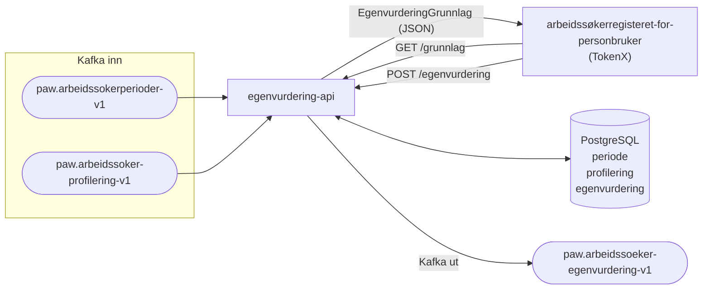

# paw-arbeidssoekerregisteret-api-egenvurdering

REST API som lar en arbeidssøker (sluttbruker) gjøre en egenvurdering av profileringen Nav har gjort av arbeidssøkeren.

📄 **API-docs (dev):** [https://egenvurdering-arbeidssoekerregisteret.intern.dev.nav.no/api/docs](https://egenvurdering-arbeidssoekerregisteret.intern.dev.nav.no/api/docs)

---

## Innhold

- [Hva gjør appen](#hva-gjør-appen)
- [Arkitektur](#arkitektur)
- [API-endepunkter](#api-endepunkter)
  - [GET /grunnlag](#get-apiv1arbeidssøkerprofileringegenvurderinggrunnlag)
  - [POST egenvurdering](#post-apiv1arbeidssøkerprofileringegenvurdering)
- [Dataflyt](#dataflyt)
- [Betingelser for å vise egenvurdering](#betingelser-for-å-vise-egenvurdering)
- [Kafka](#kafka)
- [Database](#database)
- [Autentisering og autorisering](#autentisering-og-autorisering)
- [Konfigurasjon](#konfigurasjon)
- [Relaterte tjenester](#relaterte-tjenester)
- [Lokal utvikling](#lokal-utvikling)

---

## Hva gjør appen

Appen gir arbeidssøkere mulighet til å vurdere om de er enige i NAVs profilering av dem. Flyten er:

1. Appen konsumerer `Periode`- og `Profilering`-hendelser fra Kafka og lagrer disse i en PostgreSQL-database.
2. Frontenden kaller `GET /grunnlag` for å sjekke om brukeren har en ubesvart profilering som kvalifiserer for egenvurdering.
3. Hvis grunnlag finnes, lar frontenden brukeren svare via `POST` til egenvurderingsendepunktet.
4. Svaret lagres i databasen og publiseres som en `Egenvurdering`-hendelse på Kafka-topic `paw.arbeidssoeker-egenvurdering-v1`.

---

## Arkitektur



---

## API-endepunkter

Alle endepunkter krever et **TokenX-token** fra sluttbrukeren. Swagger UI er tilgjengelig på [`/api/docs`](https://egenvurdering-arbeidssoekerregisteret.intern.dev.nav.no/api/docs).

### `GET /api/v1/arbeidssoeker/profilering/egenvurdering/grunnlag`

Henter grunnlaget for egenvurdering, dvs. den nyeste profileringen i en aktiv periode som ennå ikke har en egenvurdering.

**Respons `200 OK`:**

```json
{
  "grunnlag": {
    "profileringId": "3fa85f64-5717-4562-b3fc-2c963f66afa6",
    "profilertTil": "ANTATT_BEHOV_FOR_VEILEDNING"
  }
}
```

Feltet `grunnlag` er `null` dersom ingen kvalifiserende profilering finnes. Frontenden skal da *ikke* vise egenvurderingsskjemaet.

**Mulige verdier for `profilertTil`:**

| Verdi | Beskrivelse |
|---|---|
| `ANTATT_GODE_MULIGHETER` | NAV antar at brukeren klarer seg uten veiledning |
| `ANTATT_BEHOV_FOR_VEILEDNING` | NAV antar at brukeren trenger veiledning |

> **Merk:** `OPPGITT_HINDRINGER` er ikke støttet for egenvurdering og vil aldri returneres i `grunnlag`.

---

### `POST /api/v1/arbeidssoeker/profilering/egenvurdering`

Tar imot brukerens egenvurdering.

**Request body:**

```json
{
  "profileringId": "3fa85f64-5717-4562-b3fc-2c963f66afa6",
  "egenvurdering": "ANTATT_GODE_MULIGHETER"
}
```

**Mulige verdier for `egenvurdering`:**

| Verdi | Beskrivelse |
|---|---|
| `ANTATT_GODE_MULIGHETER` | Brukeren mener selv at de klarer seg uten veiledning |
| `ANTATT_BEHOV_FOR_VEILEDNING` | Brukeren mener selv at de trenger veiledning |

**Respons:** `202 Accepted` ved suksess.

---

## Dataflyt

### Innkommende Kafka-hendelser

Appen konsumerer to topics (consumer group `egenvurdering-api-consumer-v2`):

| Topic | Type | Handling |
|---|---|---|
| `paw.arbeidssokerperioder-v1` | `Periode` | Lagres ved åpning; slettes (inkl. tilhørende profileringer) ved avslutning |
| `paw.arbeidssoker-profilering-v1` | `Profilering` | Lagres og kobles til periode |

### Utgående Kafka-hendelse

| Topic | Type | Nøkkel |
|---|---|---|
| `paw.arbeidssoeker-egenvurdering-v1` | `Egenvurdering` (Avro v3) | Kafka-nøkkel fra `paw-kafka-key-generator` |

---

## Betingelser for å vise egenvurdering

`GET /grunnlag` returnerer et grunnlag (`grunnlag != null`) **kun** dersom **alle** betingelsene nedenfor er oppfylt:

1. **Aktiv periode:** Brukeren har en åpen arbeidsøkerperiode (ingen avslutningstidspunkt).
2. **Ikke allerede besvart:** Det finnes ingen eksisterende egenvurdering knyttet til den aktuelle profileringen.
3. **Støttet profiltype:** Profileringen er av typen `ANTATT_GODE_MULIGHETER` eller `ANTATT_BEHOV_FOR_VEILEDNING`. Profileringer med `OPPGITT_HINDRINGER` er **ikke** støttet.
4. **Etter prodsettingstidspunkt:** Perioden ble startet *etter* konfigurert `prodsettingstidspunktEgenvurdering`:
   - **dev:** `2025-11-26T13:30:00+01:00`
   - **prod:** `2025-12-11T07:00:00+01:00`

Dersom ingen treff finnes på primær-ident, forsøker tjenesten med alternative folkeregisteridenter via `paw-kafka-key-generator`.

---

## Kafka

- **Consumer-versjon:** `2` (brukes til HWM-offsetsporing i databasen)
- **Producer:** `egenvurdering-producer-v1`
- **Kafka-pool:** `nav-dev` / `nav-prod`

---

## Database

PostgreSQL (versjon 17). Migrasjon håndteres av Flyway.

### Tabeller

#### `periode`
| Kolonne | Type | Beskrivelse |
|---|---|---|
| `id` | UUID PK | Periode-ID |
| `identitetsnummer` | VARCHAR(30) | Brukerens fødselsnummer |
| `startet` | TIMESTAMP | Når perioden startet |
| `avsluttet` | TIMESTAMP (nullable) | Når perioden ble avsluttet (`null` = aktiv) |

#### `profilering`
| Kolonne | Type | Beskrivelse |
|---|---|---|
| `id` | UUID PK | Profilering-ID |
| `periode_id` | UUID FK → `periode` | Tilhørende periode |
| `profilering_tidspunkt` | TIMESTAMP | Når profileringen ble gjort |
| `profilert_til` | VARCHAR(30) | Profileringsresultat |

#### `egenvurdering`
| Kolonne | Type | Beskrivelse |
|---|---|---|
| `id` | UUID PK | Egenvurdering-ID |
| `profilering_id` | UUID FK → `profilering` | Tilhørende profilering (CASCADE DELETE) |
| `egenvurdering` | VARCHAR(30) | Brukerens egenvurdering |

#### `hwm` (High Watermark)
Brukes til offsetsporing for Kafka-consumer. Primærnøkkel er `(version, kafka_topic, kafka_partition)`.

---

## Autentisering og autorisering

- **TokenX** er eneste støttede token-type – kun sluttbrukere har tilgang.
- Azure AD er aktivert for maskin-til-maskin-kommunikasjon mot `paw-kafka-key-generator`.

---

## Konfigurasjon

Konfigureres via TOML-filer lastet med `hoplite`.

### `application_config.toml`
| Variabel | Env-variabel | Beskrivelse |
|---|---|---|
| `prodsettingstidspunktEgenvurdering` | `PRODSETTINGSTIDSPUNKT_EGENVURDERING` | Tidspunkt for prodsetting – perioder startet før dette vises ikke |
| `producerConfig.egenvurderingTopic` | `KAFKA_PAW_EGENVURDERING_TOPIC` | Kafka-topic for utgående egenvurderinger |
| `producerConfig.producerVersion` | `KAFKA_PAW_EGENVURDERING_PRODUCER_VERSION` | Kafka producer-versjon |

### Interne endepunkter

| Endepunkt | Beskrivelse |
|---|---|
| `/internal/isAlive` | Liveness probe |
| `/internal/isReady` | Readiness probe |
| `/internal/hasStarted` | Startup probe |
| `/internal/metrics` | Prometheus-metrikker |
| [`/api/docs`](https://egenvurdering-arbeidssoekerregisteret.intern.dev.nav.no/api/docs) | Swagger UI |

---

## Relaterte tjenester

| Tjeneste | Beskrivelse |
|---|---|
| [paw-arbeidssoekerregisteret-for-personbruker](https://github.com/navikt/paw-arbeidssoekerregisteret-for-personbruker) | Frontend som kaller egenvurdering-api |
| [egenvurdering-dialog-tjeneste](https://github.com/navikt/paw-arbeidssoekerregisteret-monorepo-ekstern/tree/main/apps/egenvurdering-dialog-tjeneste) | Konsumerer `paw.arbeidssoeker-egenvurdering-v1` og oppretter dialogmeldinger |
| [oppslag-api-v2](https://github.com/navikt/paw-arbeidssoekerregisteret-monorepo-ekstern/tree/main/apps/oppslag-api-v2) | Konsumerer `paw.arbeidssoeker-egenvurdering-v1` og eksponerer egenvurderinger som del av arbeidssøker-tidslinjen |

---

## Lokal utvikling

Lokal konfigurasjon ligger i `src/test/resources/local/` og `src/main/resources/local/`.

HTTP-testfiler for manuell testing ligger i `src/test/resources/requests/`:
- `api.http` – brukerendepunkter
- `api-intern.http` – interne endepunkter
- `api-docs.http` – OpenAPI-spesifikasjon

Se `docker/` i rotkatalogen for oppsett av lokale avhengigheter (Kafka, PostgreSQL osv.).
