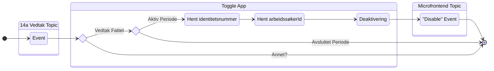
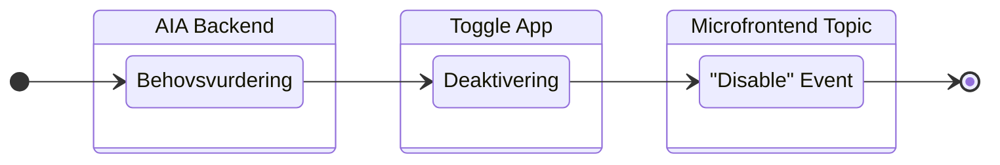
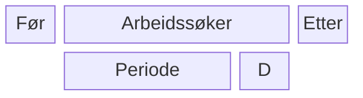

# PAW Microfrontend Toggler

Denne applikasjonen skal lytte på hendelser i arbeidssøkerdomenet, spesielt start/stopp av perioder. Hendelsene skal
tolkes for å bestemme hvilke microfrontends som skal være aktivert eller deaktivert for respektive brukere. Dette
kontrolleres ved å sende en ny hendelse på `aapen-microfrontend-v1` topic'en i Kafka. Microfrontendene som skal toggles
har ID `aia-min-side` og `aia-behovsvurdering`.

* [Repo for topic](https://github.com/navikt/min-side-microfrontend-topic-iac)
* [Beskrivelse av toggle-funksjonalitet](https://navikt.github.io/tms-dokumentasjon/microfrontend/#toggle-pa-microfrontend)

## Arbeidssøkerperiode

````mermaid
stateDiagram-v2
  direction LR
  InputEvent: Event
  [*] --> InputEvent
  
  InputTopic: Periode Topic
  state InputTopic {
    direction LR
    InputEvent
  }

  state AktivPeriodeChoice <<choice>>

  InputEvent --> AktivPeriodeChoice

  state MicrofrontendChoice1 <<choice>>
  state MicrofrontendChoice2 <<choice>>

  ToggleApp: Toggle App
  Aktivering1: Aktivering
  Aktivering2: Aktivering
  UtsattDeaktivering: Utsatt deaktivering
  Deaktivering: Deaktivering
  state ToggleApp {
    direction LR
    AktivPeriodeChoice --> MicrofrontendChoice1: Aktiv Periode?
    MicrofrontendChoice1 --> Aktivering1: AIA Min Side
    Aktivering1 --> OutputEvent1
    MicrofrontendChoice1 --> Aktivering2: AIA Behovsvurdering
    Aktivering2 --> OutputEvent2
    AktivPeriodeChoice --> MicrofrontendChoice2: Avlutt Periode?
    MicrofrontendChoice2 --> UtsattDeaktivering: AIA Min Side
    UtsattDeaktivering --> OutputEvent3
    UtsattDeaktivering --> UtsattDeaktivering: Vent 21 dager
    MicrofrontendChoice2 --> Deaktivering: AIA Behovsvurdering
    Deaktivering --> OutputEvent4
  }

  OutputTopic: Microfrontend Topic
  OutputEvent1: "Enable" Event
  OutputEvent2: "Enable" Event
  OutputEvent3: "Disable" Event
  OutputEvent4: "Disable" Event
  state OutputTopic {
    direction LR
    OutputEvent1
    OutputEvent2
    OutputEvent3
    OutputEvent4
  }
  
  OutputEvent1 --> [*]
  OutputEvent2 --> [*]
  OutputEvent3 --> [*]
  OutputEvent4 --> [*]
````

## 14a Vedtak


## Behovsvurdering


```
paw.arbeidssokerperioder-v1 topic
   "start periode" event (avsluttet == null)
      :send aktiver aia-min-side
      :send aktiver aia-behovsvurdering
   "slutt periode" event (avsluttet != null)
      :send inaktiver aia-behovsvurdering
      vent 21 dager
          :send inaktiver aia-min-side
   "identitetsnummer" endrer seg
      ??
   er mottak idempotent

pto.siste-14a-vedtak-v1 topic
   14a vedtak fattet
      gjør om aktørId  til arbeidssøkerId
      :send inaktiver aia-behovsvurdering

AIA backend:
   behovsvurdering besvart
      :send inaktiver aia-behovsvurdering

topic?
   møtestøtte brukt
      :send inaktiver aia-behovsvurdering
```

## Rapportering
```
 rapportering-endringslogg topic
    rapportering.tilgjengelig event mottatt
       :send varsel(@event_name=opprett type=oppgave) event
    rapportering.melding_mottatt event mottatt
       vil fortsette som arbeidssøker
          :send varsel(@event_name=inaktiver type=oppgave) event
       vil slutte som arbeidssøker
          for alle aktive oppgaver
             :send varsel(@event_name=inaktiver type=oppgave) event
    rapportering.leveringsfrist_naermer_seg event mottatt TODO: Definisjon mangler?
       :send varsel(@event_name=opprett type=innboks eksternVarsel=false varselId=2) event
    rapportering.leveringsfrist_utloept event mottatt
       :send varsel(@event_name=inaktiver type=innboks) event
       :send varsel(@event_name=opprett type=innboks eksternVarsel=true) event
    rapportering.grace_periode_utloept event mottatt
```



### Tidslinje
* 20+1 dager siden siste melding så deaktiveres man som arbeidsøker -> ISERV
* 28 dager etter ISERV kan man reaktiveres
* Aktiver AIA når perioden starter
* 21 dager etter perioden stopper så deaktiveres AIA

### Arbeidsmarkedsloven Paragraf 10: Enhver med opphold i norge kan registrere seg som arbeidssøker
* Har meldeplikt om fortsatt vil være arbeidsøker
* Ansvarsdeling
### NAV Loven Paragraf 14a: Rett til å få vurdert bistandsbehov av NAV
* Gjøres 14a vedtak
* PO Arbeidsoppfølging
### Dagpenger
* Kreves at man er registrert og aktiv arbeidssøker.

### Arena formidlingsgruppe
* ARBS: Arbeidsøker
  * Trenger oppfølging fra NAV
  * Ikke nødvendigvis registrert arbeidsøker om personen er gått fra IARBS
    * Registeret må synke disse for å opprette periode og opplysninger
* IARBS: Ikke Arbeidssøker
  * I arbeid men sykemeldt -> trenger oppfølging fra NAV 
* ISERV:

## Oppgaver før prodsetting
* :check: Tilgang til `paw.arbeidssokerperioder-v1` topic i prod [paw-iac repo](https://github.com/navikt/paw-iac)
* Tilgang til `min-side.aapen-microfrontend-v1` topic i prod [min-side-microfrontend-topic-iac repo](https://github.com/navikt/min-side-microfrontend-topic-iac)
* :check: Tilgang til `pto.siste-14a-vedtak-v1` topic i prod [pto-iac repo](https://github.com/navikt/pto-iac)
* Legge til outbound rule i `aia-backend` i prod [aia-backend repo](https://github.com/navikt/aia-backend)
* :check: Legge til inbound rule i `paw-kafka-key-generator` i prod [paw-kafka-key-generator repo](https://github.com/navikt/paw-kafka-key-generator)
* Legge til inbound rule i `pdl` i prod [pdl repo](https://github.com/navikt/pdl)
* :check: Enable bygg og deploy for `prod` i GitHub Actions