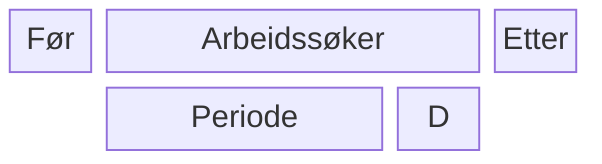

# PAW Microfrontend Toggler

Denne applikasjonen skal lytte på hendelser i arbeidssøkerdomenet, spesielt start/stopp av perioder. Hendelsene skal
tolkes for å bestemme hvilke microfrontends som skal være aktivert eller deaktivert på "Min Side" for
respektive brukere. Dette kontrolleres ved å sende en ny hendelse på `aapen-microfrontend-v1` topic'en
i Kafka. Microfrontenden som skal toggles har ID `aia-min-side`.

* [Repo for topic](https://github.com/navikt/min-side-microfrontend-topic-iac)
* [Beskrivelse av toggle-funksjonalitet](https://navikt.github.io/tms-dokumentasjon/microfrontend/#toggle-pa-microfrontend)

## Arbeidssøkerperiode
```
paw.arbeidssokerperioder-v1 topic
   "start periode" event (avsluttet == null)
      :send aktiver aia-min-side
      :send aktiver aia-behovsvurdering
   "slutt periode" event (avsluttet != null)
      :send inaktiver aia-behovsvurdering
      vent 21 dager
          :send inaktiver aia-min-side
   "identitetsnummer" endrer seg
      ??
   er mottak idempotent

pto.siste-14a-vedtak-v1 topic
   14a vedtak fattet
      gjør om aktørId  til arbeidssøkerId
      :send inaktiver aia-behovsvurdering

AIA backend:
   behovsvurdering besvart
      :send inaktiver aia-behovsvurdering

topic?
   møtestøtte brukt
      :send inaktiver aia-behovsvurdering
```

## Rapportering
```
 rapportering-endringslogg topic
    rapportering.tilgjengelig event mottatt
       :send varsel(@event_name=opprett type=oppgave) event
    rapportering.melding_mottatt event mottatt
       vil fortsette som arbeidssøker
          :send varsel(@event_name=inaktiver type=oppgave) event
       vil slutte som arbeidssøker
          for alle aktive oppgaver
             :send varsel(@event_name=inaktiver type=oppgave) event
    rapportering.leveringsfrist_naermer_seg event mottatt TODO: Definisjon mangler?
       :send varsel(@event_name=opprett type=innboks eksternVarsel=false varselId=2) event
    rapportering.leveringsfrist_utloept event mottatt
       :send varsel(@event_name=inaktiver type=innboks) event
       :send varsel(@event_name=opprett type=innboks eksternVarsel=true) event
    rapportering.grace_periode_utloept event mottatt
```



### Tidslinje
* 20+1 dager siden siste melding så deaktiveres man som arbeidsøker -> ISERV
* 28 dager etter ISERV kan man reaktiveres
* Aktiver AIA når perioden starter
* 21 dager etter perioden stopper så deaktiveres AIA

### Arbeidsmarkedsloven Paragraf 10: Enhver med opphold i norge kan registrere seg som arbeidssøker
* Har meldeplikt om fortsatt vil være arbeidsøker
* Ansvarsdeling
### NAV Loven Paragraf 14a: Rett til å få vurdert bistandsbehov av NAV
* Gjøres 14a vedtak
* PO Arbeidsoppfølging
### Dagpenger
* Kreves at man er registrert og aktiv arbeidssøker.

### Arena formidlingsgruppe
* ARBS: Arbeidsøker
  * Trenger oppfølging fra NAV
  * Ikke nødvendigvis registrert arbeidsøker om personen er gått fra IARBS
    * Registeret må synke disse for å opprette periode og opplysninger
* IARBS: Ikke Arbeidssøker
  * I arbeid men sykemeldt -> trenger oppfølging fra NAV 
* ISERV: