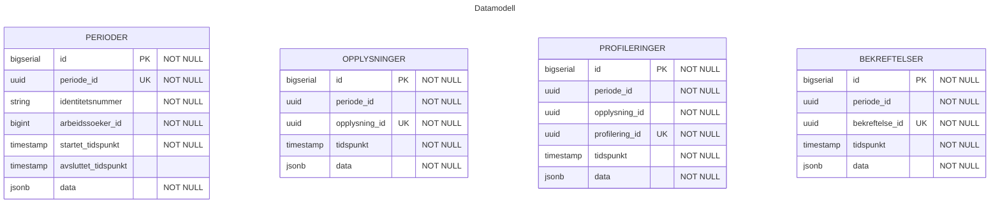

# Modell

```mermaid
---
title: Datamodell
---
erDiagram
    PERIODER {
        bigserial id PK "NOT NULL"
        uuid periode_id UK "NOT NULL"
        string identitetsnummer "NOT NULL"
        bigint arbeidssoeker_id "NOT NULL"
        timestamp startet_tidspunkt "NOT NULL"
        timestamp avsluttet_tidspunkt
        jsonb data "NOT NULL"
    }

    OPPLYSNINGER {
        bigserial id PK "NOT NULL"
        uuid periode_id "NOT NULL"
        uuid opplysning_id UK "NOT NULL"
        timestamp tidspunkt "NOT NULL"
        jsonb data "NOT NULL"
    }

    PROFILERINGER {
        bigserial id PK "NOT NULL"
        uuid periode_id "NOT NULL"
        uuid opplysning_id "NOT NULL"
        uuid profilering_id UK "NOT NULL"
        timestamp tidspunkt "NOT NULL"
        jsonb data "NOT NULL"
    }

    BEKREFTELSER {
        bigserial id PK "NOT NULL"
        uuid periode_id "NOT NULL"
        uuid bekreftelse_id UK "NOT NULL"
        timestamp tidspunkt "NOT NULL"
        jsonb data "NOT NULL"
    }
```
